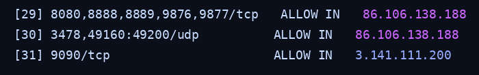

# Unreal VTuber Payments Backend

The Embody Unreal VTuber stack now ships with a lightweight payments backend that
monitors the Pixel Streaming containers and automatically accrues payouts for the
host orchestrator. Once the tracked balance reaches a configurable threshold, the
backend issues an on-chain transfer using the configured wallet.

## What this contains
- `docker-compose.unreal.yml` – TURN, signaling and packaged Unreal Engine build.
- `backend/docker-compose.yml` – payments backend container that monitors the Unreal services.
- `backend/payments` – Python package with the monitoring + payout logic.

## Quick start (local GPU host)
1. Clone the repo and enter it:
   ```bash
   git clone https://github.com/its-DeFine/Unreal_Vtuber.git
   cd Unreal_Vtuber
   ```
2. Generate TURN credentials (writes `.env.turn`):
   ```bash
   ./scripts/generate_turn_credentials.sh
   ```
3. Copy and edit the orchestrator env:
   ```bash
   cp orchestrator.env.example .env
   # edit .env with PAYMENTS_API_URL, ORCHESTRATOR_ID/ADDRESS, PUBLIC_IP,
   # and ORCHESTRATOR_HEALTH_URL=http://<PUBLIC_IP>:9090/health
   ```
4. Open the firewall for your dedicated client IP (e.g. 86.106.138.188) and the payments backend (3.141.111.200). Allow:
   - TCP 8080, 8888, 8889, 9876, 9877 from the client IP.
   - UDP 3478 and 49160‑49200 from the client IP.
   - TCP 9090 from the payments backend IP.

   

5. Launch the Pixel Streaming stack:
   ```bash
   docker network create vtuber_network 2>/dev/null || true
   docker compose -f docker-compose.unreal.yml up -d
   ```
6. Register with the payments backend (retries until it succeeds):
   ```bash
   PAYMENTS_API_URL=http://<payments-ip>:8081 \
   ORCHESTRATOR_ID=<your-id> \
   ORCHESTRATOR_ADDRESS=<your-wallet> \
   python3 scripts/register_orchestrator.py
   ```
7. Verify:
   - Pixel Streaming UI: `http://<PUBLIC_IP>:8080`
   - Runner health: `curl http://<PUBLIC_IP>:9877/health`
   - Registration: `curl http://<payments-ip>:8081/api/orchestrators`

Prefer AWS automation? See [docs/aws-onboarding.md](docs/aws-onboarding.md) for the EC2 provisioning workflow.

Need to retain recordings? Run the recorder with `--mode raw` (or the Docker one-liner) and archive the resulting `.h264/.opus` or remuxed `.mkv` files wherever you prefer.
To capture streams headlessly without Unreal changes, see [docs/stream-recorder.md](docs/stream-recorder.md); the recorder now supports automatic uploads when `--storage-url` and `--session-id` are provided.

## Registry & top-100 checks
On startup the backend records orchestrator metadata under
`backend/data/registry.json`. When `TOP_CONTRACT_*` variables are configured, it
pulls the on-chain top 100 list and only enables automatic payments if the
registered wallet appears in that set. The registration outcome (first-time
flag, outstanding balance status, and top-100 membership) is logged during
boot.

## Self-registration API
The payments service now ships with a FastAPI server bound to `PAYMENTS_API_HOST:PAYMENTS_API_PORT`.
Operators can let each Unreal orchestrator host report its metadata instead of editing `.env` manually.
A helper script lives at `scripts/register_orchestrator.py`; run it during compose startup or as part of
your provisioning pipeline. The script reads the standard `ORCHESTRATOR_*` variables plus
`PAYMENTS_API_URL` and retries with exponential backoff until the backend accepts the registration.

### Endpoint summary
- `POST /api/orchestrators/register` – accepts JSON `{"orchestrator_id", "address", ...}` and records the metadata.
  Requests are rate-limited and rejected unless the wallet is part of the current top-100 set. The response includes
  eligibility flags, cooldown status, and the current ledger balance.
- `GET /api/orchestrators` – returns the full registry including balances. Requires `X-Admin-Token` when
  `PAYMENTS_API_ADMIN_TOKEN` is set.
- `GET /api/orchestrators/{id}` – single orchestrator view with cooldown timestamps and health markers.
- Set `PAYMENTS_MANAGER_IP_ALLOWLIST` to the payments control-plane IP(s) so only trusted callers can view
  sensitive metadata such as `host_public_ip`, `last_seen_ip`, and `health_url`; other clients receive the same
  registry but with those fields redacted.

### Cooldown behaviour
If all monitored containers are down three cycles in a row the backend pauses payouts for one hour. During this window
the registry entry remains visible but `eligible_for_payments` is `false`. Re-registration simply refreshes metadata;
payments automatically resume once the cooldown expires and the orchestrator is back in the top set.

To trigger a manual registration from a host, run:

```bash
PAYMENTS_API_URL=https://payments.example.com \
ORCHESTRATOR_ID=orch-123 ORCHESTRATOR_ADDRESS=0xabc... \
python3 scripts/register_orchestrator.py
```
