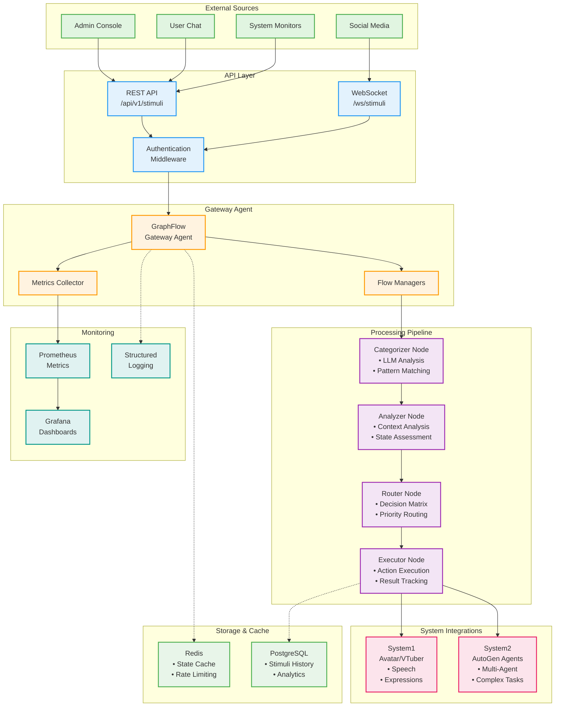
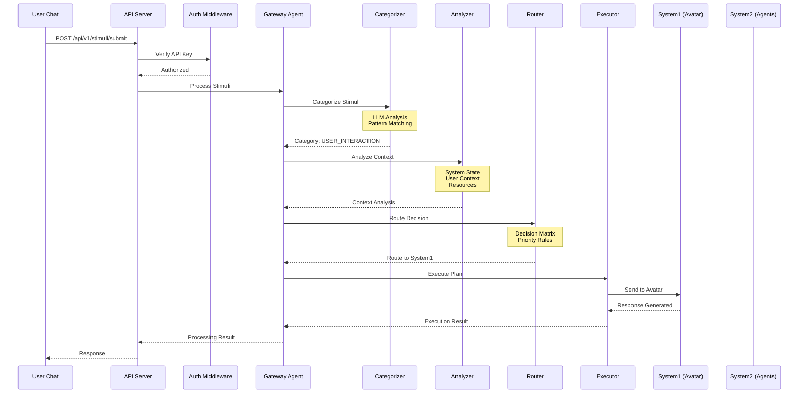

# GraphFlow External Stimuli System - Architecture Diagram

## System Architecture

## Data Flow Example

## Component Details

### 1. **API Layer**
- **REST API**: Main entry point for stimuli submission
- **WebSocket**: Real-time updates and streaming
- **Authentication**: API key-based auth with permissions

### 2. **Gateway Agent**
- **Core Orchestrator**: Manages the entire pipeline
- **Flow Managers**: Control stimuli and decision flows
- **Metrics Collector**: Tracks performance and usage

### 3. **Processing Pipeline**
- **Categorizer**: Intelligent classification using LLM
- **Analyzer**: Multi-dimensional context analysis
- **Router**: Decision-based routing logic
- **Executor**: Action execution and integration

### 4. **System Integrations**
- **System1**: Direct avatar control (speech, expressions)
- **System2**: Complex multi-agent processing

### 5. **Storage & Monitoring**
- **Redis**: Fast caching and state management
- **PostgreSQL**: Historical data and analytics
- **Prometheus/Grafana**: Real-time monitoring
- **Structured Logging**: Detailed operation tracking

## Key Features

1. **Scalability**: Horizontal scaling through stateless design
2. **Resilience**: Graceful degradation and fallback mechanisms
3. **Observability**: Comprehensive monitoring and logging
4. **Flexibility**: Extensible architecture for new integrations
5. **Performance**: Async processing and intelligent caching