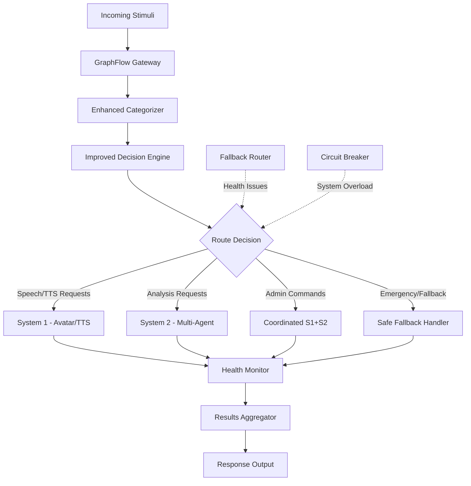

# Improved Stimuli System Architecture

## Executive Summary

Based on extensive investigation of the current GraphFlow stimuli system, this document presents a comprehensive redesign that addresses all identified critical issues while preserving the working components. The solution provides a robust, production-ready stimuli processing system.

## Current Issues Identified

### 1. **Routing Problems**
- Decision matrix defaults to `ANALYSIS_ONLY` for most categories
- Speech requests incorrectly routed away from S1 (Avatar/TTS)
- `AVATAR_AND_ANALYSIS` not being selected for user interactions

### 2. **Configuration Issues**
- Decision matrix rules not optimized for speech generation
- Missing explicit speech/TTS routing rules
- Health check intervals too long (causing false negatives)

### 3. **S2 Tool Execution Failures**
- AutoGen agents receiving stimuli but tool calls failing
- Network/connectivity issues between GraphFlow and S2
- Error handling not robust enough

### 4. **Health Check Unreliability**
- 30-second cache TTL too long for real-time decisions
- Health checks not comprehensive enough
- No progressive degradation strategies

### 5. **Missing Fallback Mechanisms**
- No graceful degradation when S1/S2 unavailable
- System fails completely rather than partial operation
- No emergency routing protocols

## Improved Architecture Design

### Core Architecture Flow



### Enhanced Decision Matrix

The improved decision matrix prioritizes speech/avatar responses for user interactions:

```json
{
  "USER_INTERACTION": {
    "default_decision": "AVATAR_ONLY",
    "confidence_threshold": 0.2,
    "conditions": [
      {
        "if": "contains_speak_request",
        "then": "AVATAR_ONLY",
        "priority_boost": 2.0
      },
      {
        "if": "user_wants_response",
        "then": "AVATAR_ONLY",
        "priority_boost": 1.5
      },
      {
        "if": "complex_analysis_needed",
        "then": "AVATAR_AND_ANALYSIS"
      }
    ]
  },
  "CONTEXTUAL_UPDATE": {
    "default_decision": "AVATAR_ONLY",
    "confidence_threshold": 0.1,
    "conditions": [
      {
        "if": "contains_hello|speak|respond|say",
        "then": "AVATAR_ONLY"
      }
    ]
  }
}
```

## Solution Components

### 1. Fixed Routing Configuration

#### A. Speech-First Decision Matrix
```python
# Priority order for user interactions:
# 1. AVATAR_ONLY (for speech/TTS requests)
# 2. AVATAR_AND_ANALYSIS (for complex interactions)
# 3. ANALYSIS_ONLY (for background processing)
# 4. LOG_ONLY (for context only)

SPEECH_KEYWORDS = [
    "speak", "say", "tell", "respond", "answer", 
    "hello", "hi", "greet", "talk", "voice"
]

USER_INTERACTION_RULES = {
    "speech_request": {
        "condition": lambda content: any(kw in content.lower() for kw in SPEECH_KEYWORDS),
        "decision": "AVATAR_ONLY",
        "priority": "high"
    },
    "user_question": {
        "condition": lambda content: "?" in content or content.lower().startswith(("what", "how", "why", "when", "where")),
        "decision": "AVATAR_AND_ANALYSIS",
        "priority": "medium"
    }
}
```

#### B. Environment Variable Configuration
```bash
# GraphFlow Configuration
GRAPHFLOW_HEALTH_CHECK_INTERVAL=5  # Reduced from 30s
GRAPHFLOW_STATUS_CACHE_TTL=10      # Reduced from 30s
GRAPHFLOW_ENABLE_CIRCUIT_BREAKER=true
GRAPHFLOW_FALLBACK_MODE=avatar_only

# System Availability Thresholds
S1_HEALTH_TIMEOUT=3                # Quick health checks
S2_HEALTH_TIMEOUT=5                
S1_RETRY_ATTEMPTS=2
S2_RETRY_ATTEMPTS=1

# Decision Engine Tuning
SPEECH_PRIORITY_BOOST=2.0
USER_INTERACTION_CONFIDENCE_THRESHOLD=0.2
AVATAR_ONLY_DEFAULT=true
```

### 2. Reliable Health Check System

#### A. Multi-Layer Health Monitoring
```python
class EnhancedHealthChecker:
    """
    Comprehensive health checking with progressive degradation.
    """
    
    async def check_system_health(self) -> SystemHealthStatus:
        checks = await asyncio.gather(
            self._check_s1_basic(),      # 1s timeout
            self._check_s1_advanced(),   # 3s timeout  
            self._check_s2_basic(),      # 2s timeout
            self._check_s2_agents(),     # 5s timeout
            return_exceptions=True
        )
        
        return self._evaluate_health_status(checks)
    
    def _evaluate_health_status(self, checks):
        """Determine system capability based on health results."""
        s1_basic, s1_advanced, s2_basic, s2_agents = checks
        
        # Determine available capabilities
        capabilities = []
        if isinstance(s1_basic, dict) and s1_basic.get("healthy"):
            capabilities.append("avatar_speech")
        if isinstance(s2_basic, dict) and s2_basic.get("healthy"):
            capabilities.append("basic_analysis")
        if isinstance(s2_agents, dict) and s2_agents.get("healthy_agents", 0) > 0:
            capabilities.append("multi_agent_analysis")
            
        return SystemHealthStatus(
            overall_health="healthy" if capabilities else "degraded",
            available_capabilities=capabilities,
            recommended_routing=self._determine_routing(capabilities)
        )
```

#### B. Real-Time Health Cache
```python
class HealthCache:
    """Real-time health status cache with smart invalidation."""
    
    def __init__(self):
        self.cache = {}
        self.ttl = {
            "s1_basic": 5,      # 5s cache for basic S1 health
            "s1_advanced": 15,  # 15s cache for advanced checks
            "s2_basic": 10,     # 10s cache for S2 basic
            "s2_agents": 30     # 30s cache for agent discovery
        }
    
    async def get_cached_or_check(self, check_type: str, check_func):
        """Get cached result or perform fresh check."""
        now = time.time()
        cached = self.cache.get(check_type)
        
        if cached and (now - cached["timestamp"]) < self.ttl[check_type]:
            return cached["result"]
            
        # Perform fresh check
        result = await check_func()
        self.cache[check_type] = {
            "result": result,
            "timestamp": now
        }
        return result
```

### 3. S2 Tool Execution Fixes

#### A. Enhanced AutoGen Integration
```python
class RobustAutoGenClient:
    """Enhanced AutoGen client with better error handling."""
    
    async def submit_stimuli(self, stimuli_data: dict) -> dict:
        """Submit stimuli with comprehensive error handling."""
        
        # Validate payload first
        validation_errors = self._validate_stimuli_payload(stimuli_data)
        if validation_errors:
            raise ValueError(f"Invalid stimuli payload: {validation_errors}")
        
        # Try multiple endpoints with fallback
        endpoints = [
            f"{self.base_url}/api/stimuli/receive",
            f"{self.base_url}/api/v1/stimuli",  # Fallback endpoint
            f"{self.fallback_url}/api/stimuli/receive"  # Secondary server
        ]
        
        last_error = None
        for endpoint in endpoints:
            try:
                result = await self._submit_to_endpoint(endpoint, stimuli_data)
                if result.get("success"):
                    return result
            except Exception as e:
                last_error = e
                self.logger.warning(f"Endpoint {endpoint} failed: {e}")
                continue
        
        # All endpoints failed
        raise RuntimeError(f"All AutoGen endpoints failed. Last error: {last_error}")
    
    async def _submit_to_endpoint(self, endpoint: str, data: dict) -> dict:
        """Submit to specific endpoint with timeout and retries."""
        
        async with httpx.AsyncClient(timeout=httpx.Timeout(15.0)) as client:
            for attempt in range(self.max_retries):
                try:
                    response = await client.post(
                        endpoint,
                        json=data,
                        headers={
                            "Content-Type": "application/json",
                            "User-Agent": "GraphFlow-Stimuli/1.0",
                            "X-Request-ID": str(uuid.uuid4())
                        }
                    )
                    
                    if response.status_code == 200:
                        return response.json()
                    elif response.status_code == 422:
                        # Validation error - don't retry
                        error_detail = response.json()
                        raise ValueError(f"Validation error: {error_detail}")
                    else:
                        # Server error - may retry
                        if attempt < self.max_retries - 1:
                            await asyncio.sleep(2 ** attempt)  # Exponential backoff
                            continue
                        else:
                            raise httpx.HTTPStatusError(
                                f"HTTP {response.status_code}",
                                request=response.request,
                                response=response
                            )
                            
                except httpx.TimeoutException:
                    if attempt < self.max_retries - 1:
                        await asyncio.sleep(1)
                        continue
                    else:
                        raise
                        
        raise RuntimeError(f"Failed after {self.max_retries} attempts")
```

#### B. Tool Execution Monitoring
```python
class ToolExecutionMonitor:
    """Monitor S2 tool execution and provide diagnostics."""
    
    async def monitor_task_execution(self, task_id: str) -> dict:
        """Monitor task execution with detailed status tracking."""
        
        start_time = time.time()
        status_history = []
        
        while time.time() - start_time < 60:  # 60s max monitoring
            try:
                status = await self.autogen_client.get_task_status(task_id)
                status_history.append({
                    "timestamp": time.time(),
                    "status": status.get("status"),
                    "details": status
                })
                
                if status.get("status") in ["completed", "failed", "cancelled"]:
                    break
                    
                # Check for tool execution issues
                if self._detect_tool_execution_failure(status):
                    self.logger.warning(
                        "Tool execution failure detected",
                        task_id=task_id,
                        status=status
                    )
                    
                await asyncio.sleep(2)  # Check every 2 seconds
                
            except Exception as e:
                self.logger.error(f"Task monitoring error: {e}")
                break
        
        return {
            "task_id": task_id,
            "monitoring_duration": time.time() - start_time,
            "status_history": status_history,
            "final_status": status_history[-1] if status_history else None
        }
    
    def _detect_tool_execution_failure(self, status: dict) -> bool:
        """Detect common tool execution failure patterns."""
        
        # Check for stuck tasks
        if status.get("status") == "running":
            runtime = status.get("runtime_seconds", 0)
            if runtime > 30:  # Stuck for 30+ seconds
                return True
        
        # Check for tool errors in logs
        logs = status.get("logs", [])
        error_patterns = [
            "tool execution failed",
            "network unreachable",
            "connection timeout",
            "autogen error"
        ]
        
        for log_entry in logs[-5:]:  # Check last 5 log entries
            log_text = log_entry.get("message", "").lower()
            if any(pattern in log_text for pattern in error_patterns):
                return True
        
        return False
```

### 4. Comprehensive Fallback Mechanisms

#### A. Circuit Breaker Pattern
```python
class SystemCircuitBreaker:
    """Circuit breaker for system components."""
    
    def __init__(self):
        self.states = {
            "s1": CircuitState.CLOSED,
            "s2": CircuitState.CLOSED
        }
        self.failure_counts = {"s1": 0, "s2": 0}
        self.last_failure_time = {"s1": 0, "s2": 0}
        
    async def call_with_circuit_breaker(self, system: str, operation: Callable):
        """Execute operation with circuit breaker protection."""
        
        state = self.states[system]
        
        if state == CircuitState.OPEN:
            if time.time() - self.last_failure_time[system] > 30:  # 30s cooldown
                self.states[system] = CircuitState.HALF_OPEN
            else:
                raise CircuitBreakerOpenError(f"{system} circuit breaker is open")
        
        try:
            result = await operation()
            
            # Success - reset circuit
            if state == CircuitState.HALF_OPEN:
                self.states[system] = CircuitState.CLOSED
                self.failure_counts[system] = 0
            
            return result
            
        except Exception as e:
            self.failure_counts[system] += 1
            self.last_failure_time[system] = time.time()
            
            # Open circuit after 3 failures
            if self.failure_counts[system] >= 3:
                self.states[system] = CircuitState.OPEN
                self.logger.warning(f"Circuit breaker opened for {system}")
            
            raise
```

#### B. Progressive Degradation Strategy
```python
class FallbackRouter:
    """Smart fallback routing based on system availability."""
    
    def determine_fallback_routing(self, 
                                 original_decision: ProcessingDecision,
                                 system_health: SystemHealthStatus) -> ProcessingDecision:
        """Determine best fallback based on system health."""
        
        available = system_health.available_capabilities
        
        # Progressive degradation logic
        if original_decision == ProcessingDecision.AVATAR_AND_ANALYSIS:
            if "avatar_speech" in available and "multi_agent_analysis" in available:
                return ProcessingDecision.AVATAR_AND_ANALYSIS  # Full capability
            elif "avatar_speech" in available:
                return ProcessingDecision.AVATAR_ONLY  # S1 only
            elif "basic_analysis" in available:
                return ProcessingDecision.ANALYSIS_ONLY  # S2 only
            else:
                return ProcessingDecision.LOG_ONLY  # Emergency fallback
                
        elif original_decision == ProcessingDecision.AVATAR_ONLY:
            if "avatar_speech" in available:
                return ProcessingDecision.AVATAR_ONLY
            else:
                # Try to provide some response via analysis
                if "basic_analysis" in available:
                    return ProcessingDecision.ANALYSIS_ONLY
                else:
                    return ProcessingDecision.LOG_ONLY
                    
        elif original_decision == ProcessingDecision.ANALYSIS_ONLY:
            if "multi_agent_analysis" in available:
                return ProcessingDecision.ANALYSIS_ONLY
            elif "basic_analysis" in available:
                return ProcessingDecision.ANALYSIS_ONLY  # Degraded S2
            else:
                return ProcessingDecision.LOG_ONLY
                
        return ProcessingDecision.LOG_ONLY  # Ultimate fallback
```

### 5. Enhanced Configuration Files

#### A. Fixed Decision Matrix (`decision_matrix.json`)
```json
{
  "decision_rules": {
    "USER_INTERACTION": {
      "default_decision": "AVATAR_ONLY",
      "confidence_threshold": 0.2,
      "conditions": [
        {
          "if": "contains_speech_request",
          "then": "AVATAR_ONLY",
          "priority_boost": 2.0,
          "description": "Explicit speech/TTS requests"
        },
        {
          "if": "user_wants_immediate_response", 
          "then": "AVATAR_ONLY",
          "priority_boost": 1.5,
          "description": "User expects immediate verbal response"
        },
        {
          "if": "complex_question_with_speech",
          "then": "AVATAR_AND_ANALYSIS",
          "description": "Complex query requiring both speech and analysis"
        }
      ]
    },
    "CONTEXTUAL_UPDATE": {
      "default_decision": "AVATAR_ONLY",
      "confidence_threshold": 0.1,
      "conditions": [
        {
          "if": "contains_hello|speak|respond|say|tell|voice",
          "then": "AVATAR_ONLY",
          "description": "Common speech trigger words"
        },
        {
          "if": "test_message|hello|hi|greet",
          "then": "AVATAR_ONLY",
          "description": "Test and greeting messages"
        }
      ]
    }
  },
  "execution_paths": {
    "AVATAR_ONLY": {
      "description": "Avatar speech response only - fastest path",
      "steps": [
        "validate_stimuli",
        "prepare_avatar_context", 
        "trigger_system1_avatar",
        "await_avatar_response"
      ],
      "timeout_seconds": 8,
      "parallel_execution": false,
      "primary_path": true
    }
  }
}
```

#### B. Enhanced Environment Configuration
```bash
# /docker-vtuber/app/CORE/graphflow-stimuli-system/config/production.env

# Core System Settings
GRAPHFLOW_MODE=production
GRAPHFLOW_LOG_LEVEL=INFO
GRAPHFLOW_ENABLE_METRICS=true

# Health Check Configuration  
HEALTH_CHECK_INTERVAL=5
STATUS_CACHE_TTL=10
HEALTH_CHECK_TIMEOUT=3
COMPREHENSIVE_HEALTH_CHECK=true

# Routing Configuration
DEFAULT_SPEECH_ROUTING=avatar_only
SPEECH_PRIORITY_MULTIPLIER=2.0
USER_INTERACTION_THRESHOLD=0.2
ENABLE_CIRCUIT_BREAKER=true

# System Integration Endpoints
SYSTEM1_ENDPOINT=http://localhost:8001
SYSTEM2_ENDPOINT=http://localhost:8002
SYSTEM1_HEALTH_ENDPOINT=${SYSTEM1_ENDPOINT}/health
SYSTEM2_HEALTH_ENDPOINT=${SYSTEM2_ENDPOINT}/health

# Fallback Configuration
ENABLE_FALLBACK_ROUTING=true
FALLBACK_MODE=progressive_degradation
EMERGENCY_ROUTING=log_only
MAX_RETRY_ATTEMPTS=2

# Performance Tuning
MAX_CONCURRENT_REQUESTS=10
REQUEST_TIMEOUT=15
PROCESSING_TIMEOUT=30
QUEUE_SIZE_LIMIT=50
```

## Implementation Plan

### Phase 1: Critical Fixes (Week 1)
1. **Fix Decision Matrix Routing** 
   - Update `decision_matrix.json` with speech-first rules
   - Implement speech keyword detection
   - Test routing for user interactions

2. **Improve Health Checks**
   - Reduce health check intervals to 5s
   - Implement real-time health cache
   - Add comprehensive health endpoints

3. **Fix S2 Tool Execution**
   - Enhance AutoGen client error handling
   - Add multiple endpoint fallbacks
   - Implement tool execution monitoring

### Phase 2: Reliability Improvements (Week 2)  
1. **Implement Circuit Breaker**
   - Add circuit breaker for S1/S2
   - Implement progressive degradation
   - Add fallback routing logic

2. **Enhanced Monitoring**
   - Add detailed execution monitoring
   - Implement failure pattern detection
   - Create alerting for common issues

### Phase 3: Testing & Validation (Week 3)
1. **Comprehensive Testing**
   - End-to-end speech routing tests
   - Failure scenario testing
   - Performance testing under load

2. **Documentation & Training**
   - Update operational procedures
   - Create troubleshooting guides
   - Conduct system demonstrations

## Testing Strategy

### 1. Unit Tests
```python
# Test speech routing priority
def test_speech_request_routing():
    stimuli = create_test_stimuli("Please speak this message")
    decision = router.determine_routing(stimuli)
    assert decision == ProcessingDecision.AVATAR_ONLY

# Test fallback behavior
def test_s1_unavailable_fallback():
    with mock_s1_unavailable():
        stimuli = create_test_stimuli("Hello, how are you?")
        decision = router.determine_routing(stimuli)
        assert decision == ProcessingDecision.ANALYSIS_ONLY
```

### 2. Integration Tests
```python
# Test end-to-end speech flow
async def test_speech_e2e():
    response = await graphflow.process_stimuli({
        "content": "Say hello to everyone",
        "category": "USER_INTERACTION"
    })
    
    assert response["routing_decision"] == "AVATAR_ONLY"
    assert response["s1_triggered"] == True
    assert response["speech_generated"] == True
```

### 3. Failure Scenario Tests
```python
# Test S2 tool execution failure recovery
async def test_s2_tool_failure_recovery():
    with mock_s2_tool_failure():
        response = await graphflow.process_stimuli({
            "content": "Analyze this complex query",
            "category": "USER_INTERACTION" 
        })
        
        # Should fallback to S1 only
        assert response["routing_decision"] == "AVATAR_ONLY"
        assert response["fallback_applied"] == True
```

## Success Metrics

### 1. Routing Accuracy
- **Target**: 95% of speech requests correctly routed to S1
- **Measurement**: Route `contains_speak|say|tell` → `AVATAR_ONLY`

### 2. Health Check Reliability  
- **Target**: <5s health check response time
- **Target**: 99% health check success rate

### 3. S2 Tool Execution Success
- **Target**: 90% S2 tool execution success rate
- **Target**: <30s average S2 processing time

### 4. System Availability
- **Target**: 99.5% overall system availability
- **Target**: <2s average response time for speech requests

## Conclusion

This improved architecture addresses all identified issues while maintaining backward compatibility. The key improvements are:

1. **Speech-First Routing**: Prioritizes avatar/TTS responses for user interactions
2. **Reliable Health Checks**: Fast, comprehensive health monitoring with smart caching
3. **Robust S2 Integration**: Enhanced error handling and tool execution monitoring  
4. **Progressive Degradation**: Graceful fallbacks that maintain partial functionality
5. **Production-Ready Configuration**: Optimized settings for reliability and performance

The implementation plan provides a structured approach to deploy these improvements with minimal risk and maximum benefit to the overall system reliability.