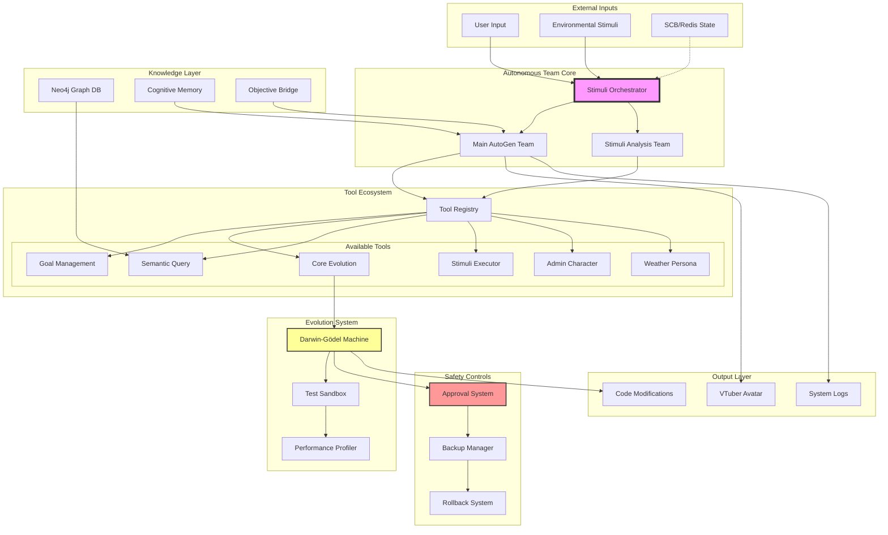
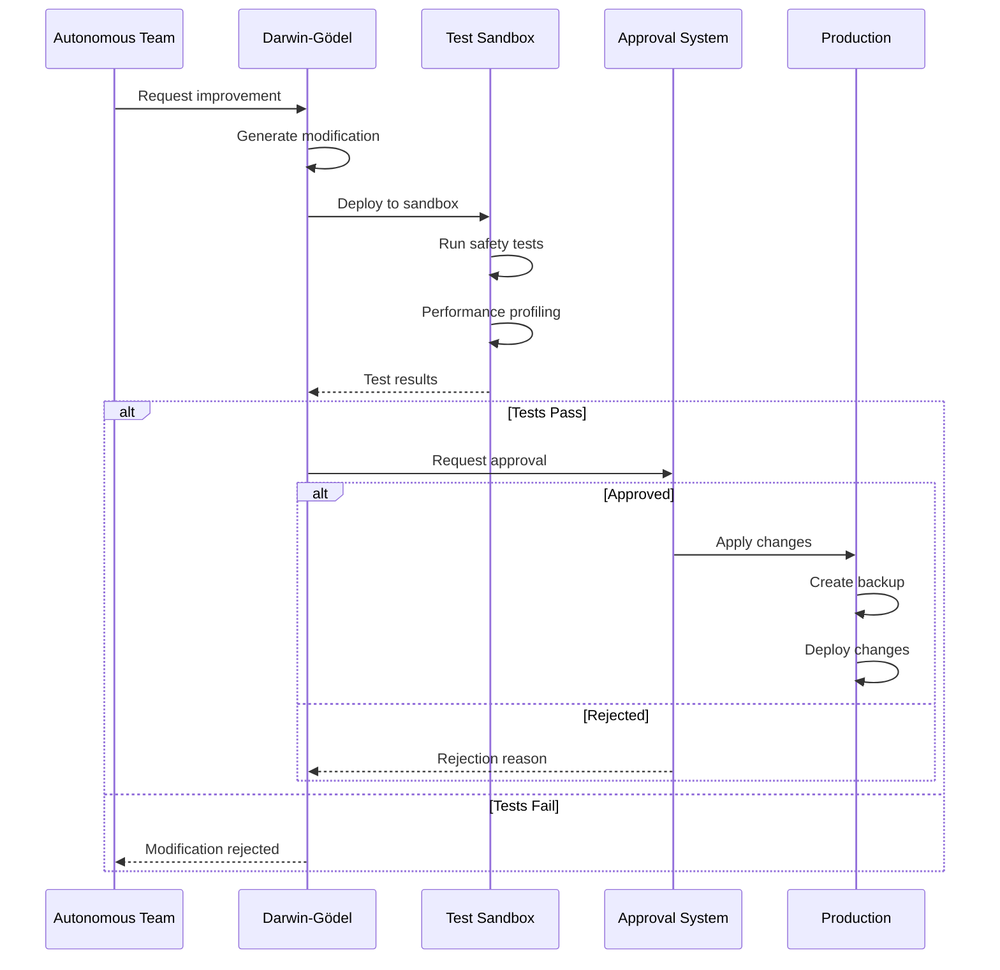

# Autonomous Team Architecture & Capabilities

## System Overview

The autonomous team operates within a carefully designed architecture that balances autonomy with safety, enabling self-improvement while preventing uncontrolled modifications.



## Current Capabilities

### 1. Tool Access & Usage

#### Available Tools
The autonomous team has access to a comprehensive set of tools:

| Tool | Purpose | Can Modify Own Code |
|------|---------|-------------------|
| Goal Management | Track and update objectives | No |
| Core Evolution | Self-improvement via Darwin-Gödel | Yes (restricted) |
| Semantic Query | Query knowledge graph | No |
| Stimuli Executor | Process external stimuli | No |
| Admin Character | Character management | No |
| Weather Persona | Weather-related functions | No |
| Medical/Education/Fitness | Domain-specific capabilities | No |

#### Tool Usage Pattern
```python
# How the team uses tools
async def use_tool(tool_name, parameters):
    tool = tool_registry.get_tool(tool_name)
    result = await tool.run(**parameters)
    return result
```

### 2. Code Modification Capabilities

#### What They CAN Modify
The team can modify these core files through the Darwin-Gödel Machine:
- `main.py` - Entry point and orchestration
- `tool_registry.py` - Tool management
- `memory_manager.py` - Memory operations
- `cognitive_decision_engine.py` - Decision making
- `mcp_server.py` - Communication server

#### What They CANNOT Modify
- Tool implementations (files in `/tools/` directory)
- System configuration files
- External service integrations
- Security-critical components
- Their own evolution constraints

#### Modification Process


### 3. SCB (Shared Context Blackboard) Integration

#### Current Status
- **Default**: Disabled (standalone mode)
- **When Enabled**: Provides inter-agent communication via Redis
- **Access Level**: Read/Write when AgentNet is enabled

#### SCB Usage
```python
# When SCB is available
if scb_client and scb_client.is_enabled():
    # Publish state updates
    scb_client.publish_state({
        "agent": "autonomous_team",
        "decision": "analyzing_weather_pattern",
        "confidence": 0.85
    })
    
    # Read other agent states
    avatar_state = scb_client.get_state("avatar")
```

### 4. Tool Creation Limitations

The team **CANNOT** dynamically create new tools because:
- Tool registry loads tools at startup only
- No runtime tool registration API
- Tools must be Python files in `/tools/` directory
- Tools require specific interface (`run()` function)

**Workaround**: They can request tool creation through objectives/goals that humans can fulfill.

### 5. Testing Capabilities

#### Pre-Deployment Testing
All code changes go through rigorous testing:

1. **Syntax Validation**
   - AST parsing
   - Import verification
   - Type checking

2. **Sandbox Testing**
   - Isolated environment (`/tmp/autogen_sandbox`)
   - Full functionality tests
   - Error handling verification

3. **Performance Testing**
   - Execution time comparison
   - Memory usage analysis
   - CPU utilization monitoring
   - Success rate tracking

4. **Safety Validation**
   - No dangerous operations
   - No external network calls
   - No file system damage
   - No infinite loops

#### Testing Metrics
```python
{
    "syntax_valid": true,
    "imports_available": true,
    "performance_delta": -15.2,  # % improvement
    "memory_delta": -5.0,        # % reduction
    "test_coverage": 0.85,       # 85% coverage
    "safety_score": 0.95         # 95% safe
}
```

## Configuration & Control

### Environment Variables
```bash
# Evolution Controls
DARWIN_GODEL_ENABLED=true               # Enable evolution system
DARWIN_GODEL_REAL_MODIFICATIONS=false   # Apply real changes (dangerous!)
DARWIN_GODEL_REQUIRE_APPROVAL=true      # Require human approval
DARWIN_GODEL_MAX_ITERATIONS=5           # Max improvement iterations

# SCB/AgentNet Integration  
AGENTNET_ENABLED=false                  # Enable multi-agent communication
AGENTNET_REDIS_URL=redis://localhost    # Redis connection

# Safety Settings
MAX_EXECUTION_TIME=30                   # Max seconds per operation
MEMORY_LIMIT_MB=1024                    # Max memory usage
BACKUP_BEFORE_MODIFY=true               # Always backup
```

### Access Control Matrix

| Component | Read | Write | Execute | Create |
|-----------|------|-------|---------|--------|
| Core Files | ✅ | ⚠️* | ✅ | ❌ |
| Tools | ✅ | ❌ | ✅ | ❌ |
| Config | ✅ | ❌ | N/A | ❌ |
| Sandbox | ✅ | ✅ | ✅ | ✅ |
| Production | ✅ | ⚠️* | ✅ | ❌ |
| External Services | ✅ | ⚠️** | ✅ | ❌ |

*With approval and safety checks
**Through defined interfaces only

## Improvement Recommendations

### 1. Enable Dynamic Tool Creation
```python
# Proposed enhancement
class ToolRegistry:
    def register_runtime_tool(self, name: str, tool_func: Callable):
        """Allow runtime tool registration with safety checks"""
        if self._validate_tool_safety(tool_func):
            self.tools[name] = RuntimeTool(tool_func)
```

### 2. Enhanced SCB Awareness
```python
# Make SCB a first-class citizen
class AutonomousTeam:
    def __init__(self):
        self.scb_monitor = SCBMonitor()
        self.scb_monitor.subscribe([
            "user_input",
            "system_state", 
            "other_agents"
        ])
```

### 3. Graduated Autonomy Levels
```python
# Progressive autonomy based on trust
AUTONOMY_LEVELS = {
    "observer": {"read": True, "write": False},
    "suggester": {"read": True, "write": False, "suggest": True},
    "modifier": {"read": True, "write": True, "approve": True},
    "creator": {"read": True, "write": True, "create": True}
}
```

### 4. Tool Testing Framework
```python
# Built-in tool testing before deployment
class ToolTester:
    async def test_new_tool(self, tool_code: str):
        # Sandboxed execution
        # Input/output validation
        # Performance benchmarking
        # Safety analysis
        return TestReport(...)
```

## Current Limitations & Workarounds

### Limitation 1: No Dynamic Tool Creation
**Workaround**: Create objectives that request tool creation from humans

### Limitation 2: Limited File Access
**Workaround**: Use Darwin-Gödel for core file improvements only

### Limitation 3: SCB Disabled by Default
**Workaround**: Enable AgentNet for multi-agent scenarios

### Limitation 4: Approval Required
**Workaround**: Build trust through consistent safe improvements

## Conclusion

The autonomous team operates within a well-designed safety framework that:
- ✅ Allows controlled self-improvement
- ✅ Provides comprehensive testing before changes
- ✅ Maintains system stability through approvals
- ✅ Enables gradual capability expansion
- ⚠️ Limits dynamic tool creation
- ⚠️ Restricts file system access
- ⚠️ Requires configuration for full SCB integration

The system prioritizes safety and stability over unrestricted autonomy, which is appropriate for production environments.