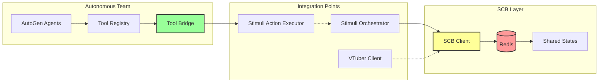

# Autonomous Team SCB Integration Status

## Current SCB Awareness Level: LIMITED ⚠️

The autonomous team has **indirect** access to SCB through the system architecture, but lacks direct SCB manipulation tools.

## Current Integration Points



## How SCB Currently Works

### 1. SCB Client Configuration
```python
# SCB is initialized in the orchestrator
self.scb_client = scb_client  # Passed from main.py

# SCB requires AGENTNET_ENABLED=true
if os.getenv("AGENTNET_ENABLED", "false").lower() == "true":
    scb_client = SCBClient(redis_url)
else:
    scb_client = SCBClient(None)  # Standalone mode
```

### 2. What Gets Published to SCB
```python
# From SCB-Neo4j Bridge
scb_updates = {
    "agent_decisions": {},      # S2 agent decisions
    "tool_executions": {},      # Tool execution results
    "state_changes": {},        # System state updates
    "stimuli_responses": {}     # Stimuli processing results
}

# Example SCB message
{
    "agent": "s2_analyst",
    "timestamp": 1720556400.123,
    "content": "Analyzing weather pattern",
    "metadata": {
        "confidence": 0.85,
        "tools_used": ["weather_persona_tool"],
        "decision": "activate_weather_report"
    }
}
```

### 3. Current Tool Access to SCB

| Tool | Direct SCB Access | Indirect SCB Access | How |
|------|------------------|-------------------|-----|
| goal_management_tools | ❌ | ✅ | Via context parameter |
| stimuli_action_executor | ❌ | ✅ | Through orchestrator |
| semantic_graph_query | ❌ | ✅ | Reads from Neo4j (which gets SCB data) |
| weather_persona_tool | ❌ | ✅ | Results published by orchestrator |
| admin_character_tool | ❌ | ✅ | Character changes tracked |
| core_evolution_tool | ❌ | ❌ | No SCB integration |

## What the Team CANNOT Do with SCB

### 1. Direct SCB Operations
```python
# ❌ No direct SCB tool exists
# The team cannot:
scb_client.publish_state(...)  # No access to scb_client
scb_client.get_state(...)       # Cannot read directly
scb_client.subscribe(...)       # Cannot subscribe to channels
```

### 2. Create SCB-Aware Tools
```python
# ❌ Tools don't receive scb_client in context
async def run(context: Dict[str, Any]) -> Dict[str, Any]:
    # context contains:
    # - action parameters
    # - agent info
    # But NOT scb_client
```

## Recommended SCB Tool Implementation

### Option 1: Create Direct SCB Tool
```python
# File: autogen_agent/tools/scb_operations_tool.py

async def run(context: Dict[str, Any]) -> Dict[str, Any]:
    """Direct SCB operations tool"""
    action = context.get("action", "read")
    
    # Get SCB client from global context
    scb_client = context.get("scb_client")
    if not scb_client or not scb_client.is_enabled():
        return {
            "success": False,
            "error": "SCB not available in standalone mode"
        }
    
    if action == "publish":
        channel = context.get("channel", "agent_state")
        data = context.get("data", {})
        scb_client.publish_state(data, channel)
        return {"success": True, "published": data}
        
    elif action == "read":
        key = context.get("key", "system_state")
        state = scb_client.get_state(key)
        return {"success": True, "state": state}
        
    elif action == "subscribe":
        channel = context.get("channel")
        # Note: Would need callback mechanism
        return {"success": False, "error": "Subscribe not yet implemented"}
```

### Option 2: Enhance Tool Context
```python
# In tool_registry.py or agent_tool_bridge.py
def execute_tool(self, tool_name: str, context: Dict[str, Any]) -> Any:
    # Inject SCB client into context
    if hasattr(self, 'scb_client'):
        context['scb_client'] = self.scb_client
    
    # Execute tool with enhanced context
    return await tool.run(context)
```

### Option 3: SCB Awareness Through Stimuli
```python
# Enhanced stimuli_action_executor.py
if action_type == "scb_operation":
    scb_action = action_params.get("scb_action")
    
    if scb_action == "broadcast":
        # Use stimuli system to broadcast via SCB
        self._broadcast_via_scb(action_params.get("message"))
        
    elif scb_action == "query":
        # Query other agents via SCB
        responses = self._query_agents_via_scb(action_params.get("query"))
```

## Current Workarounds

### 1. Use Stimuli System
```python
# The team can trigger SCB updates indirectly
stimuli = {
    "type": "scb_update",
    "content": "Request weather update",
    "metadata": {
        "target_agent": "weather_service",
        "priority": "high"
    }
}
# This gets routed through orchestrator which has SCB access
```

### 2. Query Semantic Graph
```python
# SCB data flows into Neo4j, so query there
result = semantic_graph_query_tool.run({
    "query_type": "recent",
    "query": "agent_decisions",
    "time_range": {"minutes": 5}
})
# Gets recent agent decisions from graph
```

### 3. Use Goal Management
```python
# Create objectives that require SCB integration
goal = {
    "goal": "Enable cross-agent communication",
    "requirements": [
        "Read other agent states",
        "Broadcast team decisions",
        "Subscribe to user inputs"
    ]
}
# Human implements SCB tool based on objective
```

## Impact on Autonomous Capabilities

### Current Limitations
1. **No Multi-Agent Coordination** - Cannot directly communicate with other agents
2. **No State Awareness** - Cannot read system-wide state
3. **No Event Subscription** - Cannot react to SCB events
4. **Limited Context** - Decisions made without full system awareness

### With SCB Integration
1. **Full System Awareness** - Read all agent states
2. **Coordinated Actions** - Synchronize with other agents
3. **Event-Driven Behavior** - React to system events
4. **Shared Learning** - Learn from other agent experiences

## Implementation Priority

### High Priority
1. **Create SCB Query Tool** - Read-only access to system state
2. **Enhance Tool Context** - Pass scb_client to all tools
3. **Add SCB Publish Tool** - Allow state publishing

### Medium Priority
1. **Event Subscription** - Subscribe to SCB channels
2. **Multi-Agent Queries** - Query specific agents
3. **State History** - Access historical states

### Low Priority
1. **SCB Analytics** - Analyze communication patterns
2. **Channel Management** - Create/manage channels
3. **Access Control** - Fine-grained SCB permissions

## Summary

The autonomous team currently has **very limited** SCB awareness:
- ❌ No direct SCB access tools
- ❌ Cannot read/write SCB directly
- ✅ Indirect access through orchestrator
- ✅ Results flow into SCB automatically
- ⚠️ Missing critical multi-agent coordination

**Recommendation**: Implement a dedicated SCB tool to unlock multi-agent coordination capabilities. This would significantly enhance the team's awareness and decision-making abilities.