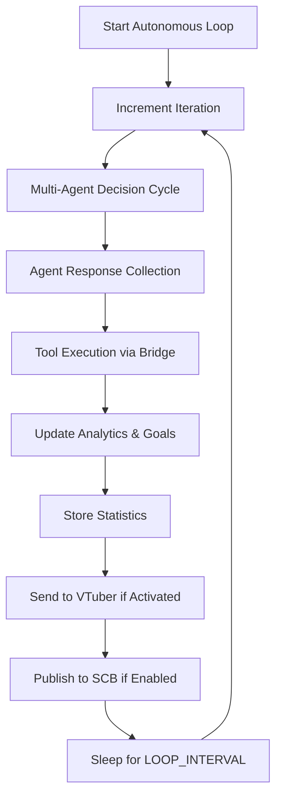
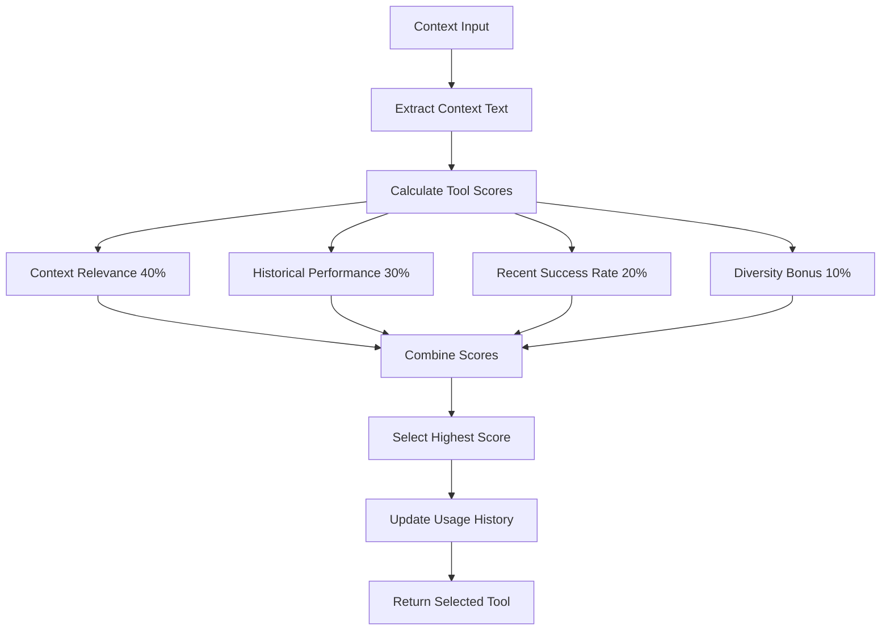
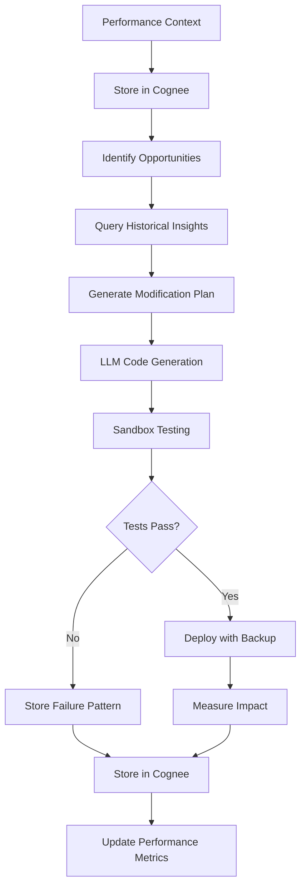
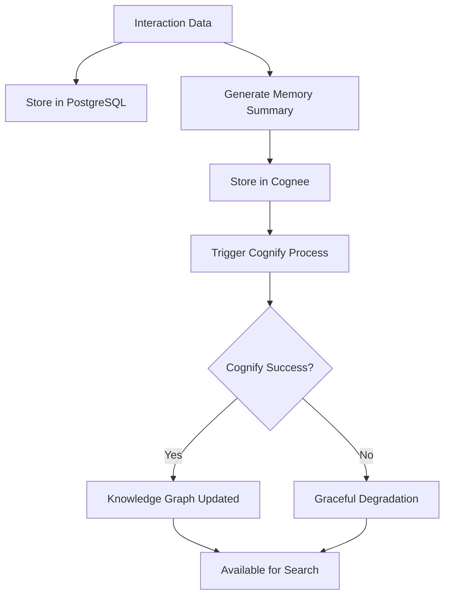

# AutoGen Agent System - Complete Documentation

## Table of Contents

1. [System Overview](#system-overview)
2. [File Structure & Components](#file-structure--components)
3. [Core Functions Documentation](#core-functions-documentation)
4. [Logic Flow Documentation](#logic-flow-documentation)
5. [Integration Patterns](#integration-patterns)
6. [Cross-Reference Guide](#cross-reference-guide)
7. [Maintenance Guide](#maintenance-guide)

---

## System Overview

The AutoGen Agent System is a sophisticated autonomous AI platform built on Microsoft's AutoGen framework, featuring multi-agent collaboration, self-improvement capabilities, and comprehensive memory management.

### Core Architecture Pillars

1. **Multi-Agent Collaboration** - Microsoft AutoGen with specialized agents
2. **Intelligent Tool Selection** - Context-aware scoring system
3. **Memory & Learning** - Cognee knowledge graph integration
4. **Self-Improvement** - Darwin-Gödel Machine for code evolution
5. **Performance Monitoring** - Comprehensive statistics and analytics

---

## File Structure & Components

### Main Application Layer

#### `autogen_agent/main.py` 
**Purpose:** Central orchestrator and entry point
**Key Functions:**
- `main()` - Application entry point and mode selection
- `run_autogen_decision_cycle()` - Core multi-agent decision loop
- `initialize_autogen_agents()` - Agent setup and configuration
- `enhanced_autonomous_loop()` - Primary autonomous operation loop

**Dependencies:** All core components
**Integration Points:** SCB, VTuber, Statistics, Evolution

#### `autogen_agent/__init__.py`
**Purpose:** Package initialization (currently empty)
**Cross-Reference:** Import point for external usage

### Client Communication Layer

#### `autogen_agent/clients/scb_client.py`
**Purpose:** Shared Cognitive Blackboard communication
**Key Functions:**
```python
- __init__(url: str) -> SCBClient
- enable_agentnet() -> None  # Activates SCB publishing
- disable_agentnet() -> None  # Stops SCB publishing
- publish_state(data: Dict, force_publish: bool) -> None  # Main data publishing
- get_status() -> Dict[str, any]  # Client status information
```
**Control Flow:** 
1. Check `AGENTNET_ENABLED` environment variable
2. If enabled → Redis publish, else → local logging
3. Graceful fallback on connection failures

**Cross-Reference:** Used in `main.py` cycles, MCP tools

#### `autogen_agent/clients/vtuber_client.py`
**Purpose:** VTuber system communication and control
**Key Functions:**
```python
- __init__(endpoint: str) -> VTuberClient
- activate_vtuber() -> None  # Enables message sending
- deactivate_vtuber() -> None  # Disables message sending  
- post_message(message: str, force_send: bool) -> None  # Send to VTuber
- get_status() -> Dict[str, any]  # Client status
```
**Control Flow:**
1. Check activation state (`vtuber_activated`)
2. If activated or forced → HTTP POST to `/process_text`
3. Fallback to logging on failure

**Cross-Reference:** Used in tools, main cycle, MCP endpoints

### Tool System

#### `autogen_agent/tool_registry.py`
**Purpose:** Dynamic tool loading and intelligent selection
**Key Functions:**
```python
- load_tools() -> None  # Scans and imports tools from tools/ package
- select_tool(context: dict) -> Optional[Callable]  # Intelligent tool selection
- _calculate_tool_score(tool_name, context, context_text) -> float  # Scoring algorithm
- execute_tool_async(tool_name, context) -> Optional[dict]  # Async execution
- execute_tool_sync(tool_name, context) -> Optional[dict]  # Sync execution
- update_tool_performance(tool_name, success, execution_time) -> None  # Performance tracking
```

**Intelligence Algorithm:**
1. **Context Relevance (40%)** - Keyword matching + semantic analysis
2. **Historical Performance (30%)** - Success rate + execution speed
3. **Recent Success Rate (20%)** - Last 10 uses performance
4. **Diversity Bonus (10%)** - Prevents tool overuse

**Cross-Reference:** Core to main loop, used by all tool execution

#### `autogen_agent/tools/` Directory

##### `goal_management_tools.py`
**Purpose:** SMART goal creation, tracking, and progress management
**Key Functions:**
```python
- define_autonomous_goal(goal_text, priority) -> Dict  # AI-enhanced goal creation
- get_active_goals(status_filter) -> Dict  # Goal retrieval
- update_goal_progress(goal_id, progress_data) -> Dict  # Progress updates  
- generate_goal_performance_report(timeframe_hours) -> Dict  # Analytics
- query_goal_memory(query, limit) -> Dict  # Historical insights
- run(context) -> Dict  # Tool entry point
```
**Logic Flow:**
1. Natural language → SMART criteria analysis
2. Cognee integration for historical patterns
3. Performance correlation analysis
4. Progress tracking with milestone detection

##### `core_evolution_tool.py`
**Purpose:** Darwin-Gödel Machine integration for self-improvement
**Key Functions:**
```python
- run(context) -> Dict  # Main evolution trigger
- _select_evolution_action(iteration, metrics, insights) -> Dict  # Action selection
- _determine_evolution_phase(iteration, improvement) -> str  # Phase detection
- _fallback_response(iteration, error) -> Dict  # Error handling
```
**Evolution Phases:**
1. **Bootstrap (0-10 iterations)** - System initialization
2. **Learning (11-50 iterations)** - Pattern recognition
3. **Optimization (51+ iterations)** - Active improvement

##### `advanced_vtuber_control.py`
**Purpose:** VTuber system control and management
**Key Functions:**
```python
- run(context) -> Dict  # Main control interface
- _execute_vtuber_action(client, action, message, duration) -> Dict  # Action execution
- create_vtuber_instance(avatar_config, medium, duration, prompt) -> Dict  # Instance creation
- control_vtuber_instance(instance_id, action, parameters) -> Dict  # Instance control
- shutdown_vtuber_instance(instance_id) -> Dict  # Instance cleanup
```

##### `variable_tool_calls.py`
**Purpose:** Dynamic tool orchestration and adaptive execution
**Key Classes:**
```python
- ToolExecutionContext(Enum)  # Context types (EVOLUTION, GOAL_PROGRESS, etc.)
- ToolCall(dataclass)  # Tool call representation
- VariableToolCallsManager  # Main orchestration class
```

### Memory & Knowledge System

#### `autogen_agent/cognitive_memory.py`
**Purpose:** Cognee integration for semantic memory
**Key Functions:**
```python
- __init__(db_url, cognee_url, cognee_api_key) -> CognitiveMemoryManager
- initialize() -> bool  # Setup database and Cognee connections
- store_interaction(context, action, result) -> str  # Store memories
- retrieve_relevant_context(query, max_results) -> List[MemoryEntry]  # Semantic search
- consolidate_knowledge() -> None  # Process relationships in Cognee
```
**Data Flow:**
1. Interaction → PostgreSQL (immediate) + Cognee (semantic)
2. Query → Cognee search → PostgreSQL enhancement → Results
3. Periodic consolidation → Knowledge graph processing

#### `autogen_agent/memory_manager.py`
**Purpose:** Simple in-memory context storage (legacy)
**Key Functions:**
```python
- __init__(db_url) -> MemoryManager
- get_recent_context() -> Dict  # Retrieve last context
- store_memory(item) -> None  # Store new memory item
```
**Note:** Legacy component, replaced by cognitive_memory for new features

### Decision Engine

#### `autogen_agent/cognitive_decision_engine.py`
**Purpose:** Advanced decision making with memory integration
**Key Functions:**
```python
- __init__(memory_manager, tool_registry) -> CognitiveDecisionEngine
- make_intelligent_decision(context) -> Dict  # Main decision process
- _select_optimal_tool(context, memories) -> Optional[str]  # Tool selection
- _calculate_tool_score(tool_name, context, memories) -> float  # Scoring with memory
- _store_decision_outcome(context, tool_name, result, time, memories) -> None  # Learning
```

**Decision Algorithm:**
1. **Memory Enhancement** - Retrieve relevant context (5 results)
2. **Tool Scoring** - Historical (40%) + Context (30%) + Recent (20%) + Diversity (10%)
3. **Execution** - Tool execution with enhanced context
4. **Learning** - Store outcome for future decisions

### Evolution System

#### `autogen_agent/evolution/cognitive_evolution_engine.py`
**Purpose:** Main evolution orchestrator combining Darwin-Gödel + Cognee
**Key Functions:**
```python
- __init__(autogen_agent_dir) -> CognitiveEvolutionEngine
- initialize() -> bool  # Setup evolution components
- analyze_and_evolve(performance_context) -> Optional[EvolutionResult]  # Main evolution cycle
- _store_performance_context(context, cycle_id) -> None  # Cognee storage
- _query_historical_insights(context, opportunities) -> Dict  # Historical analysis
- _generate_modification_plan(context, opportunities, insights) -> CodeModificationPlan  # Planning
- _execute_evolution_safely(plan, cycle_id) -> EvolutionResult  # Safe execution
```

**Evolution Cycle:**
1. **Performance Analysis** → Store in Cognee with rich context
2. **Opportunity Identification** → Code analysis for bottlenecks
3. **Historical Query** → Cognee search for similar patterns
4. **Plan Generation** → LLM-powered modification planning
5. **Safe Execution** → Darwin-Gödel sandbox testing
6. **Result Storage** → Success/failure patterns in Cognee

#### `autogen_agent/evolution/darwin_godel_engine.py`
**Purpose:** Code analysis, generation, and safe modification
**Key Functions:**
```python
- __init__(autogen_agent_dir, sandbox_dir, cognee_service) -> DarwinGodelEngine
- initialize() -> bool  # Setup sandbox and baseline metrics
- analyze_code_performance(target_file) -> List[CodeAnalysisResult]  # Code analysis
- generate_code_improvements(analysis_results, historical_context) -> List[Dict]  # LLM generation
- test_modifications_safely(improvements) -> List[SafetyTestResult]  # Sandbox testing
- deploy_safe_modifications(improvements, test_results) -> List[Dict]  # Production deployment
```

**Safety Pipeline:**
1. **Analysis** → AST parsing + complexity calculation + bottleneck detection
2. **Generation** → LLM code generation + template fallbacks
3. **Testing** → Sandbox execution + syntax validation + performance measurement
4. **Deployment** → Backup creation + real modification + rollback capability

#### `autogen_agent/evolution/llm_code_generator.py`
**Purpose:** LLM-powered code generation and improvement
**Key Functions:**
```python
- __init__(model, temperature) -> LLMCodeGenerator
- generate_code_improvement(code_context, opportunity, constraints, examples) -> str  # Main generation
- generate_with_retry(code_context, opportunity, constraints, examples, max_retries) -> str  # Robust generation
- _validate_code_syntax(code) -> bool  # Syntax validation
```

#### `autogen_agent/evolution/performance_profiler.py`
**Purpose:** Performance measurement and comparison
**Key Functions:**
```python
- __init__() -> PerformanceProfiler
- measure_performance(code, test_cases, warmup_runs, measurement_runs) -> PerformanceMetrics  # Main measurement
- compare_performance(original_code, modified_code, test_cases) -> Dict  # A/B comparison
- generate_test_cases_from_code(code) -> List[TestCase]  # Auto test generation
```

### Services Layer

#### `autogen_agent/services/cognee_direct_service.py`
**Purpose:** Direct Cognee library integration with Ollama
**Key Functions:**
```python
- __init__(dataset_name) -> CogneeDirectService
- initialize() -> bool  # Setup Cognee with Ollama configuration
- add_data(data) -> Dict  # Add data to knowledge graph
- cognify() -> Dict  # Process relationships
- search(query, limit) -> List[Dict]  # Semantic search
- store_and_process(data, auto_cognify) -> Dict  # Convenience method
```

**Configuration Pattern:**
```python
# Environment setup for Ollama integration
os.environ['LLM_PROVIDER'] = 'ollama'
os.environ['LLM_MODEL'] = 'llama3.1:8b'
os.environ['EMBEDDING_PROVIDER'] = 'fastembed'
```

#### `autogen_agent/services/evolution_service.py`
**Purpose:** Evolution service integration layer
**Key Functions:**
```python
- __init__(autogen_agent_dir, cognee_service) -> EvolutionService
- collect_performance_data(agent_metrics) -> bool  # Performance tracking
- trigger_evolution_manually(context) -> Dict  # Manual evolution trigger
- enable_auto_evolution(interval) -> Dict  # Enable automatic triggers
- get_evolution_status() -> Dict  # Status reporting
```

#### `autogen_agent/services/goal_management_service.py`
**Purpose:** Comprehensive goal management with AI enhancement
**Key Functions:**
```python
- __init__(cognee_service, evolution_service) -> GoalManagementService
- define_goal(natural_language_goal, priority) -> Goal  # AI-enhanced goal creation
- update_goal_progress(goal_id, progress_data) -> bool  # Progress tracking
- generate_performance_metrics(timeframe_hours) -> Dict  # Performance correlation
- query_goal_memory(query, limit) -> List[Dict]  # Historical insights
```

#### `autogen_agent/services/conversation_storage_service.py`
**Purpose:** Agent conversation storage and retrieval
**Key Functions:**
```python
- __init__(db_url, cognee_service) -> ConversationStorageService
- store_conversation(conversation_data) -> None  # Store complete conversations
- get_conversations(iteration, limit, offset) -> List[Dict]  # Retrieve conversations
- search_conversations(query, limit) -> List[Dict]  # Full-text search
- analyze_conversation_patterns(days) -> Dict  # Pattern analysis
```

### MCP Integration

#### `autogen_agent/mcp_server.py`
**Purpose:** Model Context Protocol server for development integration
**Key Functions:**
```python
- __init__(cognitive_system) -> AutoGenMcpServer
- initialize() -> bool  # Setup MCP server
- handle_mcp_call(tool_name, arguments) -> Dict  # Handle MCP tool calls
- _create_cognitive_mcp_tools() -> List[Dict]  # Tool definitions
```

**Available MCP Tools:**
- `get_cognitive_status` - System status
- `trigger_cognitive_decision` - Manual decision trigger
- `query_cognitive_memory` - Memory search
- `trigger_code_evolution` - Evolution trigger
- `analyze_code_performance` - Code analysis

### Statistics & Analytics

#### `autogen_agent/statistics_collector.py`
**Purpose:** Comprehensive system metrics collection
**Key Functions:**
```python
- __init__(db_url) -> StatisticsCollector
- collect_cycle_stats(cycle_data) -> None  # Cycle performance
- collect_tool_usage(tool_data) -> None  # Tool analytics
- collect_evolution_action(evolution_data) -> None  # Evolution tracking
- get_statistics(start_date, end_date) -> Dict  # Comprehensive stats
- generate_report(report_type, timeframe, filters) -> Dict  # Custom reports
```

### Monitoring & Health

#### `autogen_agent/gpu_monitor.py`
**Purpose:** GPU status and system health monitoring
**Key Functions:**
```python
- __init__() -> GPUMonitor
- get_gpu_status() -> Dict  # Comprehensive GPU info
- get_summary() -> Dict  # Quick health check
- increment_cycle_count() -> None  # Cycle tracking
```

#### `autogen_agent/ollama_monitor.py`
**Purpose:** Ollama container monitoring and model tracking
**Key Functions:**
```python
- __init__() -> OllamaMonitor
- get_ollama_status() -> Dict  # Ollama system status
- get_running_models() -> Dict  # Active model information
- estimate_gpu_usage(running_models) -> Dict  # Resource estimation
```

### Teachable Agents

#### `autogen_agent/teachable_agents.py`
**Purpose:** Teachable agent wrappers for learning capabilities
**Key Functions:**
```python
- create_teachable_agents(llm_config) -> Dict  # Create all teachable agents
- TeachableCognitiveAgent.__init__(llm_config, teach_db_path) -> TeachableCognitiveAgent
- CodeExecutionAgent.__init__(work_dir) -> CodeExecutionAgent
- get_learning_summary(agents) -> Dict  # Learning status
```

---

## Logic Flow Documentation

### Primary Autonomous Loop



### Tool Selection Algorithm



### Darwin-Gödel Evolution Pipeline



### Memory Storage Flow



---

## Integration Patterns

### Client Integration Pattern

All external communications follow this pattern:

```python
class ClientTemplate:
    def __init__(self, endpoint_or_config):
        self.enabled = bool(endpoint_or_config)
        self.activated = False  # Additional activation layer
    
    def action_method(self, data, force=False):
        # Check activation state first
        if not force and not self.activated:
            self.log_only(data)
            return
        
        # Proceed with actual action
        if self.enabled:
            self.perform_action(data)
        else:
            self.fallback_action(data)
```

**Applied in:** SCBClient, VTuberClient

### Service Initialization Pattern

All services follow this async initialization pattern:

```python
class ServiceTemplate:
    def __init__(self, dependencies):
        self.initialized = False
        self.dependencies = dependencies
    
    async def initialize(self) -> bool:
        try:
            # Setup dependencies
            # Establish connections  
            # Run health checks
            self.initialized = True
            return True
        except Exception as e:
            self.log_error(e)
            return False
```

**Applied in:** All services, evolution components, memory managers

### Tool Execution Pattern

All tools follow this execution pattern:

```python
async def run(context: Dict) -> Dict[str, Any]:
    try:
        # Validate context
        # Extract required parameters
        # Perform main logic
        # Collect performance metrics
        return {
            "success": True,
            "message": "...",
            "data": result_data
        }
    except Exception as e:
        return {
            "success": False,
            "error": str(e),
            "message": f"Tool failed: {e}"
        }
```

**Applied in:** All tools in `tools/` directory

---

## Cross-Reference Guide

### Function Dependencies Map

| Function | Direct Dependencies | Used By |
|----------|-------------------|---------|
| `main()` | `initialize_autogen_agents()`, `enhanced_autonomous_loop()` | Application entry |
| `run_autogen_decision_cycle()` | `AgentToolBridge`, `SCBClient`, `VTuberClient` | `enhanced_autonomous_loop()` |
| `tool_registry.select_tool()` | Tool performance data, context analysis | Decision cycles, MCP server |
| `cognitive_memory.store_interaction()` | PostgreSQL, Cognee service | Tool executions, decision outcomes |
| `darwin_godel_engine.analyze_and_evolve()` | LLM generator, Performance profiler | Evolution service, MCP tools |

### Configuration Dependencies

| Component | Environment Variables | Default Values |
|-----------|----------------------|----------------|
| SCB Client | `AGENTNET_ENABLED`, `REDIS_URL` | `false`, `None` |
| VTuber Client | `VTUBER_ENDPOINT` | `None` |
| Darwin-Gödel | `DARWIN_GODEL_REAL_MODIFICATIONS`, `DARWIN_GODEL_REQUIRE_APPROVAL` | `false`, `true` |
| Cognee | `COGNEE_URL`, `COGNEE_BEARER_TOKEN` | `None`, `None` |
| AutoGen | `USE_AUTOGEN_LLM`, `USE_OLLAMA`, `OLLAMA_MODEL` | `true`, `false`, `llama3.2:3b` |

### Data Flow Cross-References

| Data Type | Origin | Storage | Usage |
|-----------|--------|---------|-------|
| Performance Metrics | `run_autogen_decision_cycle()` | `StatisticsCollector` | Evolution triggers, Analytics |
| Tool Scores | `ToolRegistry._calculate_tool_score()` | In-memory | Tool selection, Performance tracking |
| Memories | `CognitiveMemoryManager.store_interaction()` | PostgreSQL + Cognee | Decision enhancement, Historical analysis |
| Evolution Results | `DarwinGodelEngine.deploy_safe_modifications()` | Cognee + File backups | Learning patterns, Rollback capability |
| Goal Progress | `GoalManagementService.update_goal_progress()` | PostgreSQL + Cognee | Performance correlation, Analytics |

---

## Maintenance Guide

### Adding New Tools

1. **Create tool file** in `autogen_agent/tools/new_tool.py`
2. **Implement `run(context: Dict) -> Dict` function**
3. **Add context keywords** to `tool_registry.py` context mapping
4. **Test tool selection** with various contexts
5. **Update this documentation** in Tool System section

### Adding New Services

1. **Create service file** in `autogen_agent/services/new_service.py`
2. **Follow Service Initialization Pattern**
3. **Add to dependency injection** in `main.py`
4. **Create global getter function** if needed
5. **Update Integration Patterns** in documentation

### Modifying Evolution Logic

1. **Update `cognitive_evolution_engine.py`** for high-level changes
2. **Update `darwin_godel_engine.py`** for code-level changes
3. **Test in sandbox mode** first (`DARWIN_GODEL_REAL_MODIFICATIONS=false`)
4. **Update Evolution Pipeline** documentation
5. **Verify safety mechanisms** still function

### Adding MCP Tools

1. **Add tool definition** to `mcp_server._create_cognitive_mcp_tools()`
2. **Implement handler** in `mcp_server.handle_mcp_call()`
3. **Test with MCP client**
4. **Update MCP Integration** documentation

### Performance Optimization

1. **Check Tool Selection Algorithm** for new bottlenecks
2. **Review Memory Storage Flow** for efficiency
3. **Monitor statistics collection** overhead
4. **Update Cross-Reference Guide** with new metrics

### Documentation Maintenance Checklist

When making code changes:

- [ ] Update function documentation if signatures change
- [ ] Update Logic Flow diagrams if control flow changes  
- [ ] Update Integration Patterns if new patterns emerge
- [ ] Update Cross-Reference Guide if dependencies change
- [ ] Update Configuration Dependencies if new env vars added
- [ ] Update Maintenance Guide if new patterns established

---

## Version Information

- **Documentation Version:** 1.0.0
- **Code Base Version:** Current as of analysis date
- **Last Updated:** [Current Date]
- **Maintainer:** AutoGen Documentation System

---

*This documentation is designed to be maintained alongside code changes. Please update relevant sections when modifying the codebase.*